# 多智能体媒体出版流水线架构说明书 (Multi-Agent Publishing Pipeline Architecture)

> **修订日期**：2026-07-05
> **目的**：固化“多智能体对抗与单一职责流水线”的设计，防止后续维护时因指令超载导致 Agent 架构漂移（Architecture Drift）。未来添加任何新规则时，**严禁将新规则强塞给现有的 Agent**，必须通过增加独立的子流水线车间来解决。

## 1. 核心设计哲学 (Core Philosophy)

1. **指令超载必然导致规则泄露 (Instruction Overload = Rule Leakage)**：大模型无法同时完美执行超过 5 个维度的不同任务（如同时兼顾文采、逻辑、排版、查阅资料）。
2. **单一职责原则 (Single Responsibility Principle, SRP)**：每一个 Agent（或 Skill）只做一件事，且必须做到极度偏执。
3. **没有对抗就没有深度 (Adversarial Mechanism)**：禁止主笔 Agent “自己审自己”。大纲必须经过魔鬼代言人（Devil's Advocate）的毒舌攻击；代码必须由独立的 Research Agent 去真实拉取。

---

## 2. 角色定义与分工 (Agent Roles)

本系统由 1 个主控 Agent 和 7 种专门的 Subagent（子智能体）构成：

### 2.1 主控层
- **`blog-writer` (总控调度者 / General Contractor)**：
  - **职责**：整个流水线的总包工头。不直接执行研究、大纲设计、正文撰写等具体工作，而是通过 `invoke_subagent` 调度下游子智能体，并逐一等待各环节交付。
  - **禁忌**：不负责最终的质量检查，不凭空捏造架构细节，不亲自写正文。

### 2.2 内容生产层（写前准备 + 起草）
- **`blog-researcher` (深度研究员)**：
  - **职责**：深入物理世界。根据主控的指令，去真实的本地或远程 GitHub 仓库，把核心配置（如 YAML/JSON）和目录树拉取到上下文中，产出 `research_report.md`。
  - **触发节点**：步骤 2（深度研究阶段）。
- **`blog-outliner` (大纲与规约设计师)**：
  - **职责**：读取研究报告，回答核心判断和故事线问题，设计全景图与视觉配图计划，并输出标准的 `article-spec.yml` 规约文件。绝不直接撰写博客正文。
  - **触发节点**：步骤 3（大纲设计阶段）。
- **`devils-advocate` (魔鬼代言人/严苛主编)**：
  - **职责**：在正式写作前，无情攻击大纲规约 `article-spec.yml`。专门检查大纲是否使用了痛点驱动（SCQA）模型，强制撕裂平铺直叙的无聊结构。输出 APPROVED 或 REJECTED。
  - **触发节点**：步骤 3.6（大纲确立阶段）。
- **`blog-drafter` (正文初稿撰写者)**：
  - **职责**：将已获批的 `article-spec.yml` 与 `research_report.md` 编译成标准的 Hexo Markdown 草稿，执行术语先行、代码大白话机制翻译及 AI 句式过滤等写作规范。
  - **触发节点**：步骤 4（起草阶段）。

### 2.3 质量门禁层（写后审查流水线）
- **`editor-copy` (文字编辑)**：
  - **职责**：像除草机一样扫描全稿，全局替换诸如“不是...而是”等典型 AI 味词汇，将高高在上的说教口吻改为平视的探讨口吻。
- **`editor-citation` (事实与引用核查员)**：
  - **职责**：只盯专有名词。发现任何英文缩写，立刻检查旁边有没有“人话解释”以及 `[1]` 格式的 Markdown 引用，并在文末补全 URL。
- **`editor-evidence` (硬核证据与逻辑核查员)**：
  - **职责**：消除知识的诅咒。强制拦截“扔下 YAML 就跑”的行为，要求每段代码下方必须有大白话翻译；强制拦截“没有铺垫直接上代码”，要求在深水区前必须有“全景认知对齐”的过渡。
- **`editor-format` (排版语法核查员)**：
  - **职责**：只盯物理语法。检查嵌套反引号是否错乱、图片相对路径是否合法，确保页面渲染不崩塌。

---

## 3. 标准作业流程 (SOP)

未来任何一篇深度技术博客，都必须绝对遵循以下不可逆的工作流：

```mermaid
sequenceDiagram
    participant User as 人类 (User)
    participant Writer as 总控 (blog-writer)
    participant Researcher as 研究员 (blog-researcher)
    participant Outliner as 规划师 (blog-outliner)
    participant DA as 魔鬼代言人 (devils-advocate)
    participant Drafter as 主笔 (blog-drafter)
    participant Editors as 审查流水线 (4x Editors)

    User->>Writer: 写一篇关于 X 的复盘

    rect rgb(20, 50, 20)
        Note over Writer,Researcher: 阶段 1：硬核物料采风
        Writer->>Researcher: invoke_subagent(blog-researcher)
        Researcher-->>Writer: research_report.md
    end

    rect rgb(40, 40, 40)
        Note over Writer,DA: 阶段 2：大纲设计 + 红蓝对抗
        Writer->>Outliner: invoke_subagent(blog-outliner)
        Outliner-->>Writer: article-spec.yml
        Writer->>DA: invoke_subagent(devils-advocate)
        DA-->>Writer: REJECTED
        Writer->>Outliner: 修改后重新提交
        Writer->>DA: 再次审核
        DA-->>Writer: APPROVED
    end

    Writer->>User: 大纲已定，请过目
    User-->>Writer: 同意推进

    rect rgb(20, 20, 50)
        Note over Writer,Drafter: 阶段 3：闭门起草初稿
        Writer->>Drafter: invoke_subagent(blog-drafter)
        Drafter-->>Writer: source/_posts/slug.md
    end

    rect rgb(50, 20, 20)
        Note over Writer,Editors: 阶段 4：四重流水线质检
        Writer->>Editors: 1. editor-copy (去 AI 味)
        Writer->>Editors: 2. editor-citation (查术语/角标)
        Writer->>Editors: 3. editor-evidence (查代码翻译与全景图)
        Writer->>Editors: 4. editor-format (查排版防崩)
    end

    Editors-->>Writer: 四项体检全部合格
    Writer->>User: 完稿，请验收
```

---

## 4. 防漂移准则 (Anti-Drift Principles)

当系统的维护者（无论是人类还是下一次迭代的 AI）试图修改这个工作流时，请默念：
1. **绝不合并 SKILL**：不要试图把 `editor-copy` 和 `editor-citation` 合并为一个文件以求“省事”，这一定会导致规则泄露。
2. **新增规则 = 新增车间**：如果未来发现大模型在 SEO 关键词密度上总是犯错，**不要**在 `blog-writer` 里加一句“注意 SEO”；**必须**新建一个 `editor-seo` SKILL 并插入到审查流水线中。
3. **大纲是法律**：未经 `Devil's Advocate` 和人类共同 Approve 的大纲，绝对不允许进入起稿阶段。
