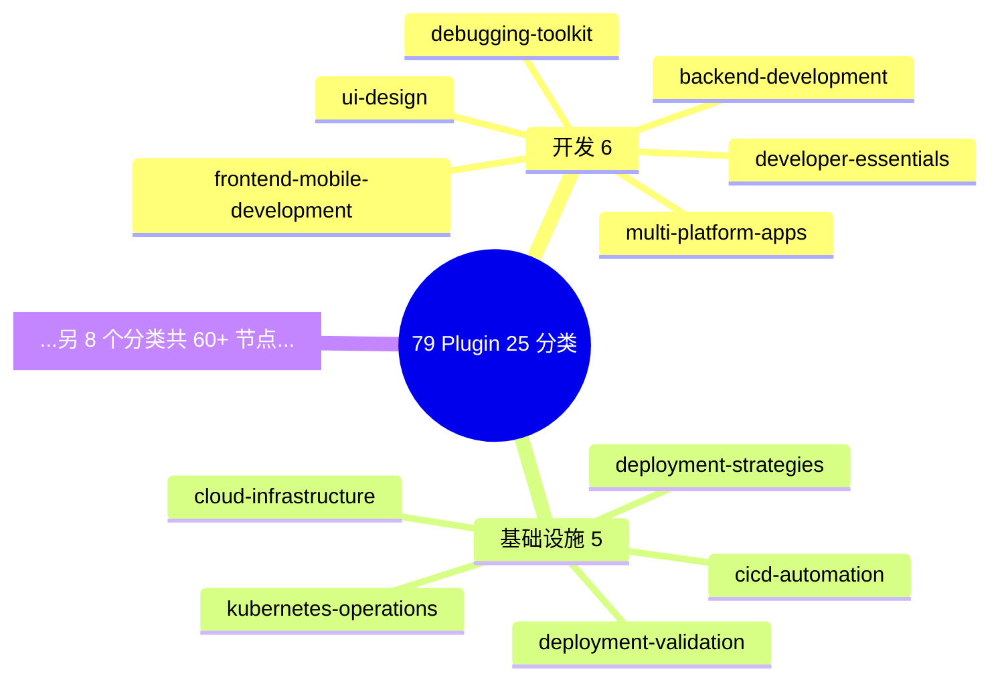
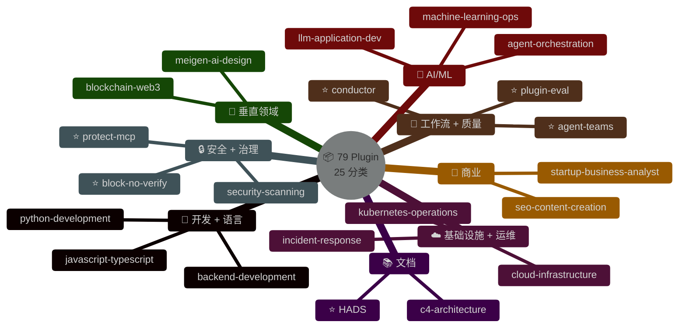

# Mermaid 美学与布局手册

> 语法文档（[syntax.md](syntax.md)）告诉你怎么**画出图**；本文告诉你怎么**让图好看**。
>
> 每条规则都来自真实踩坑——图能渲染不等于图能看。

## 0. 第一性原则：图丑时先优化，不要换技术栈

**当用户说"这图丑"、"美化一下"、"布局不合理"时——默认优化原图，不要换 HTML/Architecture/Infographic**。

换技术栈是隐性的推翻重建，代价：
- 丢失 mermaid 的文本可编辑性
- 中英文各维护两份图增加心智负担
- 依赖 Hugo unsafe HTML，可移植性变差
- 用户可能只是嫌布局，换掉等于没听懂需求

**诊断顺序**（从便宜到贵）：
1. 节点太密 → 精简节点数
2. 方向选错 → LR ↔ TB 切换
3. 配色太淡 → 补主题变量 + classDef
4. subgraph 失衡 → 补齐节点数
5. 还不行 → 这时候才考虑换 architecture HTML

---

## 1. 密度上限（核心规则）

| 图类型 | 节点数上限 | 超出后果 |
|--------|-----------|---------|
| `mindmap` | 总共 ≤ 25 | 力导向布局开始重叠、标签错位、根节点被遮挡 |
| `flowchart` 单个 subgraph | ≤ 5 | 框内拥挤、节点文字挤压 |
| `flowchart` subgraph 总数 | ≤ 6 | 横向超出 16:9 容器被截断 |
| `sequenceDiagram` 参与者 | ≤ 6 | 每列宽度不足，箭头标签重叠 |
| `classDiagram` 类数 | ≤ 8 | 关系线交错难读 |

**超出上限 → 不是拆图，是精简展示**：每分支只保留 2-3 个最具代表性的节点，完整清单用文本目录/表格承接。图负责概览，文字负责详查。

**反例**（实际事故）：
```
❌ mindmap 塞进 79 个 plugin 分 25 个分类
→ 节点重叠、标签错位、根节点 "79 Plugin/25 分类" 被其他节点遮挡

✅ 同样数据：每分支保留 2-3 个代表，下方加注
   "每类仅列 2-3 个代表，完整 79 项见下面目录"
→ 节点数从 60+ 降到 25，布局立刻清爽
```

---

## 2. 方向选择：LR vs TB

| 条件 | 方向 | 原因 |
|------|------|------|
| subgraph ≤ 3 | LR 可以 | 三栏横排仍在 16:9 容器内 |
| subgraph ≥ 4 | **必须 TB** | LR 会横向超宽被博客容器截断 |
| 线性流程（3-5 步） | LR | 符合阅读方向 |
| 层级结构（parent→child） | TB | 视觉上对应心智模型 |
| mindmap | 自动（不用指定） | 力导向布局 |

**反例**（实际事故）：
```
❌ flowchart LR 放 4 个 Tier subgraph
→ 整图宽度超出内容区 720px，右侧 "部署+打磨" 被切掉

✅ 改为 flowchart TB，每个 subgraph 内部仍用 direction LR 横排节点
→ 图占满内容宽度，所有 Tier 完整显示
```

---

## 3. Subgraph 节点数要等量

每个 subgraph 显示的节点数应**相同或接近**（差不超过 1）——视觉对齐决定美感。

**反例**：
```
❌ Tier 1: 4 个 agent, Tier 2: 2 个, Tier 3: 3 个, Tier 4: 3 个
→ Tier 2 明显缩水，右侧留大片空白失衡

✅ 全部补齐到 4 个
→ 四列等高等宽，视觉平衡
```

即使某个分组真的只有 2 个主要项，也要**找 2 个次要项凑齐**——图的目的是传达结构，不是 100% 枚举。

---

## 4. Subgraph 标题内联元信息

把能塞进标题的元信息**全塞进去**——省去外部长箭头标签。

**反例**：
```
❌ subgraph T1["Tier 1"]
      A1[backend-architect]
   end
   T1 -->|42 agents, Opus 4.7, $5/$25 per M, plan + review| T3
→ 箭头标签超长、换行失败、影响相邻 subgraph 布局

✅ subgraph T1["🧠 Tier 1 · Opus 4.7 · 42 agents · $5/$25 per M — plan + review"]
      A1[backend-architect]
   end
   T1 ==>|plan| T3
→ 元信息在 subgraph title 内紧凑排版；箭头只用最简关键词
```

**标题组件分隔推荐**：
- `·` U+00B7（middle dot）分隔并列字段
- `—` U+2014（em dash）分隔类别与描述
- `&nbsp;` 控制间距（mermaid 支持 HTML entities）

---

## 5. 主题变量四件套

**每张 mermaid 图首行都加**：


字段说明：
| 字段 | 推荐值 | 作用 |
|------|--------|------|
| `theme` | `dark` | 深色博客/文档主题基底 |
| `fontSize` | `14px`（flowchart）/ `15px`（mindmap） | 避免默认字体过小 |
| `fontFamily` | `ui-sans-serif,system-ui` | 系统字体栈，跨平台一致 |
| `lineColor` | `#60a5fa`（蓝）或 `#94a3b8`（灰） | 连线在深色背景的对比度 |

---

## 6. classDef 三件套（不是单件）

**反例**：
```
❌ classDef opus stroke:#f59e0b
→ 只有描边，填充还是默认灰，没有辨识度
```

**正例**：
```
✅ classDef opus fill:#7c2d12,stroke:#f59e0b,color:#fde68a,stroke-width:2px
→ fill（背景）+ stroke（边框）+ color（文字）+ stroke-width（强调）
```

**调色板参考**（深色主题下文字对比度 AA+）：

| 类别 | fill | stroke | color |
|------|------|--------|-------|
| 强调/红 | `#7c2d12` | `#f59e0b` | `#fde68a` |
| 中立/灰 | `#374151` | `#9ca3af` | `#f3f4f6` |
| 成功/绿 | `#065f46` | `#34d399` | `#d1fae5` |
| 主色/蓝 | `#1e3a8a` | `#60a5fa` | `#dbeafe` |
| 警示/紫 | `#581c87` | `#c084fc` | `#ede9fe` |
| 节点默认 | `#1e293b` | `#475569` | `#e2e8f0` |

**常见疏忽**：只给 subgraph 应用 classDef，忘了给里面的节点也应用 classDef node → 导致节点仍是默认白底，和 subgraph 背景不协调。
```
class T1,T2,T3,T4 opus        # ← subgraph
class A1,A2,A3,A4,B1,B2 node  # ← 别忘了内部节点
```

---

## 7. Emoji 做视觉锚点

分类节点/subgraph 标题加 emoji 前缀，**扫一眼就能分辨类别**：

| 领域 | 推荐 emoji |
|------|-----------|
| 开发/语言 | 🎨 💻 |
| 基础设施 | ☁️ 🏗️ |
| 安全 | 🔒 🛡️ |
| 数据/AI | 🤖 📊 |
| 工作流 | 🔄 ⚙️ |
| 文档 | 📚 📝 |
| 业务 | 💼 📈 |
| 质量 | 🔍 ✅ |
| 性能 | ⚡ |
| 规划/思考 | 🧠 |
| 快速/轻量 | ⚡ |

**节点内部的标记**：用 `⭐` 标记独家/重点、`✓` 标记完成、`⚠️` 标记警告——一眼看出层级。

---

## 8. 箭头的粗细表达重要性

mermaid 支持 3 种箭头，用它们区分主链路和支链路：

| 语法 | 渲染 | 用途 |
|------|------|------|
| `-->` | 细实线 | 普通流向 |
| `==>` | **粗实线** | 主链路、关键路径 |
| `-.->` | 虚线 | 可选/旁路/依赖 |

**示例**：
```
T1 ==>|plan| T3 ==>|implement| T4    # 主编排链路
T2 -.->|optional cost swap| T1        # 可选切换
```

---

## 9. 完整示例（Before / After）

### Before（事故版）

问题：节点数 60+，根节点被遮挡，标签横穿。

### After（修复版）

外加一行注释说明「每类仅列 2-3 个代表，完整 79 项见下面目录」。

---

## 10. 自检清单（画完 mermaid 后跑一遍）

- [ ] 首行有 `%%{init}%%` 主题变量？
- [ ] 节点总数在密度上限内？超出就精简而不是拆图
- [ ] 4+ subgraph 已经用 TB 不是 LR？
- [ ] 每个 subgraph 节点数相同或接近？
- [ ] subgraph 标题内联了元信息，箭头标签短？
- [ ] classDef 三件套（fill + stroke + color）齐全？
- [ ] 内部节点也 `class ... node` 应用了样式？
- [ ] 分类节点有 emoji 前缀？
- [ ] 主链路用 `==>` 粗箭头？
- [ ] 本地 `hexo server` 预览过一次，不是只看语法通过？
