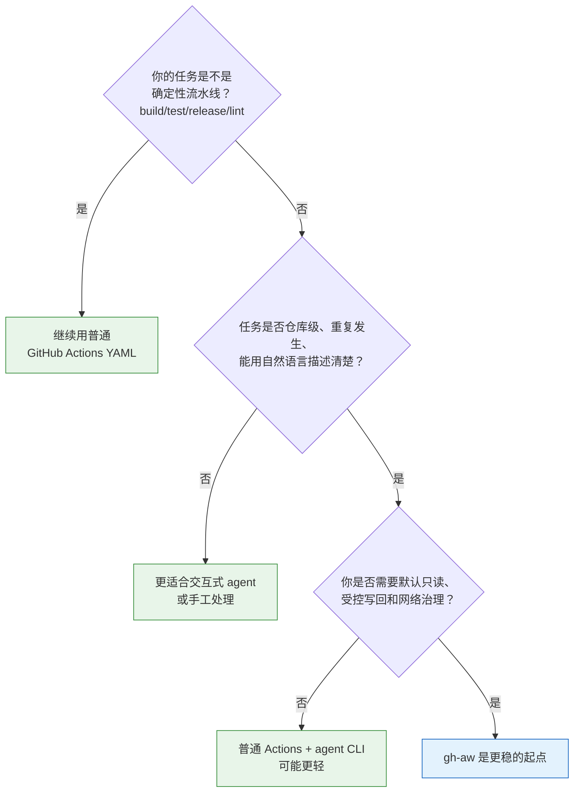

维护过十几个开源仓库的人大概都有过这种时刻：issue 积压到两位数，PR review 全靠一两个人轮着看，文档在代码改了三次之后还没人更新。直觉反应是"要不要让 AI Agent 来帮忙"——但紧接着就是另一个问题：你打算给这个 Agent 多大的权限？

如果你之前在仓库里试过 [gh-aw 这组核心仓库的协同方式](/2026/06/28/github-agentic-workflows/)，大概已经对 `gh-aw`、`gh-aw-actions`、`gh-aw-mcpg`、`gh-aw-firewall` 的分工有了基本印象。这篇文章要回答的是一个更深的问题：**当 Agent 进入 GitHub workflow 之后，从 workflow.md 到最终受控外化的完整链路到底长什么样？**

如果你直接在 GitHub Actions 里塞一个 Copilot 或 Claude CLI，Agent 确实能跑起来。但默认情况下，它同时拿到仓库读权限、网络权限、甚至写权限。它确实能干活，但很难回答"出了问题是哪个环节放出来的""副作用发生在哪里""这个模型凭什么直接写回 GitHub"。

[GitHub Agentic Workflows](https://github.com/github/gh-aw)[1]（命令行工具叫 `gh-aw`，是 [GitHub CLI](https://cli.github.com/)[2] 的一个扩展）就是为了解决这个治理问题而生的。2026 年 2 月它进入 [technical preview](https://github.blog/changelog/2026-02-13-github-agentic-workflows-are-now-in-technical-preview/)[3]，6 月 11 日升级到 [public preview](https://github.blog/changelog/2026-06-11-github-agentic-workflows-is-now-in-public-preview/)[4]。到我的判断是：**它的核心价值不是简单地"让 AI 在 GitHub Actions 里跑起来"，而是提供了一套从自然语言 workflow 定义、编译、沙箱运行、MCP 工具访问、网络隔离、威胁检测，到 Safe Outputs 受控外化的完整 Agent 自动化工程体系。**

它把用户输入从复杂的 GitHub Actions YAML 提升为 Markdown workflow，同时把高风险的 Agent 写操作拆成可审查、可校验、分阶段、最小权限的执行链路。

这篇文章从用户视角出发，解释这套体系到底解决什么问题、各个 `gh-aw-*` 组件如何协作、背后的架构原理是什么，最后给出一个明确判断：它是否值得使用，适合谁，不适合谁。

## 背景：为什么需要 GitHub Agentic Workflows

GitHub Actions 已经非常擅长做确定性的 CI/CD 任务——build、test、release、lint，这些都是"给定输入、预期输出固定"的流水线。但有一类任务它不太擅长：需要理解上下文、做推理、根据具体情况做判断的任务。比如读一个 issue 的内容，理解它描述的是 bug 还是 feature request，关联到对应的模块，给出标签建议，甚至草拟一个修复方案——这些任务需要的是"理解"而不是"执行"。我之前的 [dotfiles 配置解析](/2026/02/07/dotfiles/) 里也提到过，日常工作流真正稀缺的不是工具本身，而是把判断力用在值得花时间的地方。

AI Agent 进入 GitHub workflow 之后，带来的不是单一的好处，而是一对核心矛盾。一方面，Agent 确实能理解自然语言、代码上下文、Issue/PR/Comment，可以自动完成 triage、review、fix、文档维护、release 辅助等过去只能靠人力轮转的工作。但另一方面，Agent 不是确定性程序。一个精心构造的 issue 描述可能是 prompt injection 的载体；一段生成的 patch 可能夹带恶意逻辑；一次外联请求可能把仓库内容泄露到外部服务器。

所以问题的关键从来不是"能不能在 Actions 里跑 Agent"——这件事今天就能做到。关键问题是：**能不能安全、可控、可审计地跑 Agent。** 我实际研究完这套架构之后发现，GitHub 选择把四件事拆到不同仓库，不是工程师洁癖，而是因为它想把"意图编译""运行时积木""工具治理""网络与写回约束"这四个本来容易搅在一起的关注点分开——这一点我在 [之前对 gh-aw 仓库群的分析](/2026/06/28/github-agentic-workflows/) 里也强调过，拆开之后用户反而更容易判断边界。

GitHub Agentic Workflows 的设计目标就是回应这个关键问题：用 Markdown 定义 Agent Workflow，用 GitHub Actions 承载执行，用多层安全机制把 Agent 行为约束在可控范围内。它不是要替代你现有的 build/test/release 流水线，FAQ 里写得很明确——这是 **100% additive** 的自动化层[5](https://github.com/github/gh-aw/blob/main/docs/src/content/docs/reference/faq.md)。

## 用户视角：输入是什么，输出是什么

在拆架构之前，先把输入输出模型搞清楚。站在用户视角，你只需要关心两件事：你给系统什么，系统给你什么。

### 用户输入

你主要提供三样东西：

**第一，`workflow.md`。** 这是一个用 Markdown 编写的 Agentic Workflow 文件。前半部分的 frontmatter 定义触发器（`on`）、权限（`permissions`）、引擎（`engine`）、网络白名单（`network`）、工具（`tools`）、Safe Outputs 策略等边界条件；后半部分的 markdown 正文用自然语言描述 Agent 要完成的任务。官方文档把 `.md` 当源码、`.lock.yml` 当编译产物，这个类比很关键[6](https://github.com/github/gh-aw/blob/main/docs/src/content/docs/introduction/how-they-work.mdx)。

**第二，GitHub 上下文。** 触发 workflow 的 Issue、Pull Request、Comment，仓库里的代码，以及 Labels、Branch、Commit、Files 等元信息。这些是 Agent 理解和执行任务的原材料。

**第三，可选配置。** AI engine 选型（Copilot、Claude、Codex、Gemini[7](https://github.com/github/gh-aw) 等）、MCP tools、network allowlist、Safe Outputs 策略、threat detection 策略、权限和人工审批策略。这些决定了 Agent 的能力边界和安全边界。

### 系统输出

系统最终产出四样东西：

**第一，`.lock.yml`。** 由 `gh-aw` 编译出的标准 GitHub Actions workflow 文件。这是实际被 GitHub Actions 执行的确定性工作流——你的 `.md` 是意图，`.lock.yml` 是可执行的契约。

**第二，Agent 运行结果。** 包括日志、artifacts、structured outputs、patch / bundle / report 等。这些是 Agent 在沙箱内完成推理和操作后生成的中间产物。

**第三，受控 GitHub 写操作。** Create Issue、Create Pull Request、Add Comment、Add Labels、Update Discussion 等。注意——这些写操作不是 Agent 直接拿高权限 token 去执行的，而是通过 Safe Outputs 机制由独立 job 以最小权限完成的。

**第四，安全审查结果。** threat detection 的 verdict、Safe Outputs 的 validation result、被批准或被阻断或需要人工介入的结论。

用户感知到的是"写 Markdown，让 Agent 帮忙处理仓库任务"；平台内部做的是"编译、隔离、工具访问、审查、受控外化"。理解这个输入输出模型，后面拆解架构时就不会迷路。

## 一句话理解整体架构

如果要把整套体系压缩成一行，它是这样的：

`workflow.md` → `gh-aw compile` → `.lock.yml` → `GitHub Actions Runner` → `gh-aw-actions 准备 runtime` → `Agent Runtime` → `gh-aw-firewall 控制网络` → `gh-aw-mcpg 提供 MCP 工具访问` → `Safe Outputs MCP 记录写操作意图` → `gh-aw-threat-detection 审查产物` → `Safe Outputs 以最小权限外化到 GitHub`

下面这张图把用户面和 GitHub 基础设施层的完整架构画了出来，包括每个组件在链路中的位置和相互关系：

然后给每个组件一个定位标签：

| 组件 | 定位 |
|------|------|
| `gh-aw` | 控制面和编译器 |
| `gh-aw-actions` | 运行时动作库 |
| `gh-aw-firewall` | 网络隔离层 |
| `gh-aw-mcpg` | MCP 工具访问层 |
| `gh-aw-threat-detection` | 后置安全审查层 |
| `gh-aw-harness` | 测试验证层 |
| GitHub Actions / Runner | 承载执行的基础设施 |

接下来展开看每个组件。

## 组件逐一解读

### `github/gh-aw`：核心 CLI、DSL、编译器、文档中心

[gh-aw](https://github.com/github/gh-aw)[1] 是整套体系的核心入口。用户写的是 `workflow.md`，`gh-aw` 负责解析 frontmatter 和 markdown instructions，做 schema 校验、安全规则校验、编译规则处理，最终生成 `.lock.yml`——这是 GitHub Actions 真正会执行的 workflow 文件。

它做的事情本质上是一个**编译器**的工作：把自然语言的任务描述转化为可执行、可审计、可版本化的 workflow。编译过程中会做 expression safety check、action pinning、依赖组装[8](https://github.com/github/gh-aw/blob/main/docs/src/content/docs/reference/compilation-process.md)——其中 action pinning 把所有 `uses: repo@v6` 这类版本标签解析成不可变 commit SHA（输出格式 `repo@sha # version`），查找顺序是仓库内 `.github/aw/actions-lock.json` → 二进制内嵌的 golden pins → GitHub API 动态解析，供应链替换风险在编译期就被挡掉，很多风险在进入运行时之前就被拒掉了。

**用户价值**：你不需要直接手写复杂的 YAML，不需要关心运行时文件怎么铺设。Workflow 的 source of truth 变成 Markdown——易读、易维护、协作友好。编译结果可以提交、review、追踪，和代码一样走 PR 流程。

### `github/gh-aw-actions`：运行时 Actions 库

[gh-aw-actions](https://github.com/github/gh-aw-actions)[9] 不是给你直接写 workflow 的入口，而是编译产物依赖的共享动作库。它的 `setup-cli` 和 `setup` action 在 GitHub Actions Runner 中执行，负责安装或准备 `gh-aw`，复制 runtime scripts、prompts、MCP runtime、Safe Outputs runtime files，为 Agent job 准备执行环境。

这里最容易忽略的是：`gh-aw-actions` 不是"示例仓库"或"辅助仓库"，而是主仓库运行时契约的一部分。编译过程文档说得很明确，生成的 `.lock.yml` 会引用这里的 actions，而且 pin 更新由 `gh aw compile` 统一管理[8](https://github.com/github/gh-aw/blob/main/docs/src/content/docs/reference/compilation-process.md)。版本标签与主仓库对齐。

版本对齐背后有具体工程：`sync-actions.yml` workflow 从主仓 `github/gh-aw` sparse-checkout `setup/`、`setup-cli/`、`.github/aw/`、`pkg/` 镜像过来，可按 semver / SHA / `latest` 触发并打对齐 tag[9](https://github.com/github/gh-aw-actions)。运行时 `setup` 还会用 `compat.json` 兼容矩阵校验编译时用的 `gh-aw` 版本：`blockedVersions` 命中直接 fail，低于 `minimumVersion` 也 fail，低于 `minRecommendedVersion` 只告警；`agent-compat-v1` 则给 Copilot、Claude 列出 `min-gh-aw`/`max-gh-aw` 到 `min-agent`/`max-agent` 的对应表，确保引擎版本与 `gh-aw` 版本兼容。

**用户价值**：compiled workflow 可以在 runner 上自动准备 Agent 执行环境，复杂的运行时依赖被封装成可复用的 Action，你不用关心底层文件怎么铺设。

### `github/gh-aw-firewall`：网络隔离与出站控制

[gh-aw-firewall](https://github.com/github/gh-aw-firewall)[10]（Agent Workflow Firewall，简称 AWF）是网络隔离层。它的工作机制是：使用 Docker sandbox 运行你的命令，内部由 Docker Compose 编排一组容器（最多 6 个 service）——核心是 Squid proxy（按域名白名单过滤出站流量）和 Agent 容器（运行你的命令，所有 HTTP/HTTPS 都被 `iptables-init` 容器用 DNAT 强制路由到 Squid）；可选的有 API proxy sidecar（持有 LLM API key，向 Agent 注入占位 key 使真实密钥永远不到达 Agent 进程）、cli-proxy（给 `gh` CLI 走 DIFC 隧道）、doh-proxy（DNS-over-HTTPS，防止 DNS 层外泄）。

README 列出的能力包括 declarative config（JSON/YAML + JSON Schema）、域名和 URL 控制（allow/deny 规则、SSL Bump）、数据保护控制（DLP 扫描、DNS-over-HTTPS、agent runtime 限制）、API proxy 能力（OpenAI、Anthropic、Copilot、Gemini targets 的 rate limit 和 token steering），以及 operational tooling（预拉镜像、检查日志/统计/审计）。

**用户价值**：让 Agent 在受控网络边界内运行。对开源社区尤其重要——Issue/PR/Comment 可能包含恶意 prompt，AWF 把这种隐性外联显式化，降低 prompt injection 导致数据外泄的风险。

### `github/gh-aw-mcpg`：MCP Gateway

[gh-aw-mcpg](https://github.com/github/gh-aw-mcpg)[11] 是 MCP Gateway。[MCP](https://modelcontextprotocol.io/)[12]（Model Context Protocol）本来是 agent 连接外部工具的协议层，但协议本身不负责治理。`gh-aw-mcpg` 的作用是把多个 MCP server 收进一个统一 HTTP 网关里，再做容器隔离、认证和 guard policy。

它支持 routed mode 和 unified mode，可以代理 GitHub MCP、Safe Outputs MCP 和其他 MCP servers。最有差异化的是 **guard policies**：每个 server 可以配 `allow-only`（限制哪些 repo、什么 integrity level 的内容对 Agent 可见）或 `write-sink`（标记只写通道）。`allow-only` 里可以设 `repos`（`all` / `public` / 精确匹配 / 前缀匹配）、`min-integrity`（`merged` / `approved` / `unapproved` / `none`）、`blocked-users`、`approval-labels`、`trusted-users`、`tool-call-limits` 等策略。

生产环境 guard 由 **WASM** 实现（从 `MCP_GATEWAY_WASM_GUARDS_DIR` 加载、per-server 分配），底层是 secrecy/integrity 双标签的 DIFC（Data Integrity/Flow Control）6 阶段流水线。`write-sink` 在启用 guards 时对**所有输出 server 必需**，其 `accept` 要匹配 `allow-only.repos` 产出的 secrecy tag（例如 `private:owner/repo`），只有标签匹配的写意图才会被放行到输出通道。网关还能以 **proxy mode**（`awmg proxy`）作为 HTTP 正向代理运行，拦截 `gh` CLI 及 REST/GraphQL 请求，把它们映射到同一套 guard 工具名后跑相同的 DIFC 流水线——这样 DIFC 治理不只覆盖 MCP 工具，也覆盖非 MCP 的直连 API 调用。

**用户价值**：工具访问更可控。MCP server 可以统一接入、统一路由、统一治理。对维护多个仓库的团队来说，这比"让每个 agent 进程自己连自己的 MCP server"要可控得多。

### `github/gh-aw-threat-detection`：威胁检测组件

[gh-aw-threat-detection](https://github.com/github/gh-aw-threat-detection)[13] 在 Safe Outputs 外化之前分析 Agent 输出的 artifacts。它检测三类威胁：prompt injection、secret leak、malicious patch。工作机制是运行一个独立的 agentic engine pass（Copilot、Claude、Codex 均可），引擎通过 `threat_detection_result` 工具报告 verdict，detector 收到有效 verdict 后立即终止引擎进程以控制成本。这里有个关键安全属性是 **first-write-wins**：verdict 经 `report-result` 子命令原子写入私有文件（临时文件 + `os.Rename`），一旦有效 verdict 落盘就不再接受覆写——即便 LLM 后续被 prompt injection 操纵想改判，也只会拿到 "already recorded"，拿不到篡改 verdict 的窗口。

Exit codes 设计得很清晰：`0` = safe（无威胁）、`1` = threat detected、`2` = 基础设施或配置错误。README 特别强调：**不要将 "safe" 结果视为安全保证**，它只是纵深防御中的一环，需要结合最小权限、人工 review 和仓库保护一起使用。

因为 detector 通常跑在 AWF 沙箱里，stdout 对 GitHub Actions host 不可达，所以还有个 `conclude` 子命令负责桥接：它从共享挂载读 `detection_result.json`，把结果映射成 `gh-aw` orchestrator 的 `success` / `threat_detected` / `agent_failure` / `parse_error`，并导出 `GH_AW_DETECTION_CONCLUSION`、`GH_AW_DETECTION_REASON` 供 `safe_outputs` gate 消费。默认 **fail-closed**——检测到威胁或结果文件缺失就以非零退出阻塞下游写操作；若设置了 `GH_AW_DETECTION_CONTINUE_ON_ERROR`，则退化为 **advisory-only**：`threat_detected` 不再让 job 失败，只留信号给人审。

**用户价值**：在 Agent 输出真正写入 GitHub 前增加一道审查。对自动创建 PR、评论、Issue 的场景非常关键。这是让 Agent 工作流适合在真实开源项目中使用的关键组件。

### `github/gh-aw-harness`：测试与验证 Harness

[gh-aw-harness](https://github.com/github/gh-aw-harness)[14] 当前还是一个很小的 Go 起点。README 坦率地说：它包含一个 stub CLI、一个 tiny package、baseline CI 和一个 Copilot smoke test，harness contract 和 production behavior 还需要在 spec 中定义和实现。

它不是主执行链路的一部分，但对生态稳定性重要。当前定位是 smoke test、行为验证、回归验证——用于验证 Agentic Workflow 的行为是否符合预期。

**用户价值**：帮助验证 workflow 行为。适合做样例仓、回归测试仓、基础设施团队验证仓。对希望规模化推广 Agent workflow 的团队有价值，但目前还不是你必须关心的一环。

## 编译与运行全链路

把前面的组件串起来，从你提交 `workflow.md` 到 GitHub 上出现一个 PR 或 Comment，中间经历了什么：

```mermaid
flowchart LR
    A["1. 用户编写\nworkflow.md"] --> B["2. gh-aw\n解析 DSL / frontmatter"]
    B --> C["3. gh-aw\n生成 .lock.yml"]
    C --> D["4. 提交到仓库"]
    D --> E["5. GitHub Event\n触发 Actions"]
    E --> F["6. Runner\n执行 compiled workflow"]
    F --> G["7. gh-aw-actions\n准备 runtime"]
    G --> H["8. Agent Runtime\n启动"]
    H --> I["9. 读取 Issue/PR/\nComment/Repo Context"]
    I --> J["10. 通过 gh-aw-mcpg\n调用 MCP tools"]
    J --> K["11. gh-aw-firewall\n控制网络访问"]
    K --> L["12. 生成 artifacts\n和 SafeOutputs intent"]
    L --> M["13. gh-aw-threat-detection\n审查 artifacts"]
    M --> N["14. Safe Outputs\n结构化校验 + 过滤"]
    N --> O["15. 最小权限 job\n写入 GitHub API"]
    O --> P["16. Issue/PR/\nComment/Label"]

    style A fill:#e1f5fe,stroke:#0288d1
    style P fill:#e8f5e9,stroke:#388e3c
    style M fill:#fff3e0,stroke:#f57c00
    style N fill:#fff3e0,stroke:#f57c00
    style O fill:#fce4ec,stroke:#c62828
```

这条链路里最值得注意的一个设计原则是：**Agent 不应该直接拥有高权限 GitHub token，也不应该直接写 GitHub。** 写操作被拆成了 `intent → artifact → detection → validation → scoped write job` 五个阶段。Agent 在沙箱内生成结构化意图，threat detection 审查之后，Safe Outputs 根据策略做校验和过滤，最后由一个独立的最小权限 job 把结果写入 GitHub API。

这意味着即使 Agent 被 prompt injection 操控，它的写操作也会被拦截在 Safe Outputs 这一关——它只能生成意图，不能直接执行。

落到 GitHub Actions job 层面，编译产物是一条命名作业链：`pre_activation`（角色 / 标签 / skip 门控）→ `activation`（组装 prompt、校验 secret）→ `agent`（沙箱内跑引擎）→ `safe_outputs`（detection 通过后才跑，持最小写权限）→ `conclusion`（状态上报、失败处理），外加可选的 `apm`（打包 / 还原 agent 依赖）和 frontmatter 里自定义的 build/test job。其中 Safe Outputs 在 agent job 内就有一套**实时校验**：跑在 agent 进程里的 Safe Outputs MCP server（HTTP，port 3001）对每次写意图做 schema / rate-limit / 字段消毒校验，合法的追加进 `outputs.jsonl`，非法的当场拒回 agent；到了 `safe_outputs` job 再做一次**去重**（同 run 内相同评论去重、`group: true` 时关旧 issue 防 dup）后才以最小权限写 GitHub API。此外，workflow 用了 `expires` 字段时，编译器还会额外生成 `agentics-maintenance.yml`，用 pin 过的 action 做过期清理。

## 核心能力 TOP 3

从工程角度看，这套系统最独特的三个能力是什么？

### TOP 1：Markdown 到 GitHub Actions 的 Agent Workflow 编排能力

它把 Agent 自动化从复杂 YAML 和脚本中抽象出来。用户用自然语言描述任务，编译器负责生成可执行 workflow。`.md` 是源码，`.lock.yml` 是编译产物，这个分层让 workflow 的意图和实现分离——意图易读易审，实现可 pin 可追踪。这不是简单的"YAML 糖衣"，而是一个把自然语言任务描述编译为确定性 Actions 编排的 DSL 系统。

### TOP 2：安全执行链路

它不是裸跑 Agent。组合起来的安全层包括：默认 read-only agent job、AWF 网络隔离、MCP Gateway 工具治理、Safe Outputs 写操作缓冲、Threat Detection 后置审查、最小权限 externalization job。这六层叠在一起，使得 Agent 工作流更接近生产可用，而不是 demo。每一层单独拿出来都不新鲜，但组合在一起形成纵深防御，这在开源 Agent 工具里比较少见。

### TOP 3：可扩展工具接入与治理

通过 MCP Gateway 和 MCP tools 接入 GitHub、Safe Outputs、外部工具，并可以做 guard、auth、routing、policy。`allow-only` 的 integrity filtering（`merged` / `approved` / `unapproved` / `none`）、`blocked-users`、`approval-labels`、`trusted-users` 这些策略，让工具治理可以细化到"这个 repo 的内容在什么 integrity level 下对 Agent 可见"。适合扩展到复杂仓库和组织级自动化场景。

## 典型使用场景

哪些任务适合用 GitHub Agentic Workflows 来处理？

**Issue 自动 triage。** 读取 issue 内容，识别类型、模块、优先级，给出 label 或回复建议。重复发生、需要一点判断、最好留痕——这是 gh-aw 最典型的使用场景。

**PR 自动 review。** 分析 diff，检查文档、测试、风险点，生成 review comment。Agent 在沙箱内完成分析，review comment 通过 Safe Outputs 以最小权限写入，不会直接把写权限交给 Agent。

**自动修复或创建 PR。** 根据 issue 或 failing test 生成 patch，通过 Safe Outputs 创建 PR。需要 threat detection 和人工 review 作为额外保障——这是"Agent 做草稿、人做决策"的模式。

**文档维护。** 根据代码变化更新 README / docs，给出文档缺口建议。文档更新通常风险较低，适合做首批试点的 workflow 类型。

**开源社区运营。** 总结讨论、归类问题、推荐下一步处理动作。对 issue 量大的开源项目尤其有价值，能显著降低 maintainer 的 triage 负担。读 [《大教堂与集市》](/2024/09/19/The-Cathedral-the-Bazaa/) 的时候我就在想，开源协作真正稀缺的不是自动化本身，而是把人力留给真正需要人判断的地方——gh-aw 处理的正是这类"高频但低价值判断"的自动化。

**组织级 Agent workflow 平台。** 多仓库标准化 workflow、工具接入统一治理、安全策略统一下发。这是 gh-aw 最有想象空间但也最需要投入的方向——适合有平台工程团队的组织。

## 适合谁，不适合谁

### 适合

先画一张决策树，帮你快速判断自己是不是 gh-aw 的目标用户：

**开源社区 maintainer**——issue 和 PR 量大、需要持续 triage 和 review 辅助，且对安全边界有天然敏感度。

**有 GitHub Actions 基础设施的团队**——不需要额外引入调度平台，复用已有的 runner、secrets、environments、audit 体系。

**想把 AI Agent 纳入 CI/CD 和 repo automation 的团队**——gh-aw 是 100% additive 的层，不影响现有流水线。

**重视安全、审计、最小权限和治理的组织**——AWF + MCPG + Safe Outputs + Threat Detection 的四层纵深防御是这套体系的核心卖点。

**希望把 Agent workflow 做成标准化平台能力的团队**——Markdown 作为 source of truth、编译产物可审查、运行时可复用，适合组织级推广。

### 不适合

**只想本地临时用 AI 写代码的个人用户**——gh-aw 是为仓库级、事件驱动的自动化设计的，不是交互式编码工具。

**没有 GitHub Actions 使用基础的项目**——这套体系叠在 Actions 之上，没有 Actions 基础设施就没有承载层。

**不愿意维护安全策略、MCP 配置、权限模型的团队**——系统的复杂度不是免费的，你需要理解并配置 network allowlist、guard policies、safe outputs 策略等。

**期望 Agent 直接拥有高权限并自动修改生产仓库的团队**——gh-aw 的设计哲学是"Agent 不直接写"，如果你要的就是 Agent 直接写，那这套体系会显得束缚太多。

**对误判、成本、延迟没有容忍度的强实时任务**——threat detection 本身是一个独立的 agentic engine pass，会增加额外成本和延迟；检测结果也不是绝对保证。

## 优点与风险

### 优点

从工程视角看，这套体系有几个明确的优势：

**用户输入简单**——Markdown workflow 比手写 Actions YAML 门槛低得多，非 CI/CD 专家也能定义 Agent 任务。

**编译产物可审查**——`.lock.yml` 是确定性、可版本化的，可以走 PR review 流程，不是黑盒。

**运行时可复用**——`gh-aw-actions` 把运行时依赖封装成共享 Action，compiled workflow 在不同仓库间可复用。

**安全边界清晰**——firewall 控制网络、mcpg 治理工具、safe outputs 缓冲写操作、threat detection 后置审查，四层各有职责。

**扩展性较好**——MCP tools 可以接入 GitHub、外部 API、自定义工具，guard policies 可以细化到 repo 级别。

**适合组织级标准化**——Markdown 源码 + 编译产物 + 共享 Action 库的模式，适合多仓库统一推广。

### 风险

但也要诚实看到代价：

**系统复杂度较高**——你需要理解 GitHub Actions、MCP、网络隔离、权限模型、Safe Outputs 策略，这不是装一个 CLI 就完事的事。

**Threat Detection 不是绝对安全保证**——README 自己说了，"Do not treat a 'safe' result as a security guarantee"。它是纵深防御的一环，不是银弹。

**Agent 输出仍需要人工监督**——尤其是创建 PR、修改代码等高风险操作，human review 仍然是必要的。

**CI 运行成本和 AI token 成本需要控制**——threat detection 本身是一个独立的 agentic engine pass，有额外的 token 消耗。`gh-aw` 主仓库在 2026 年 6 月还专门发了公告退役了几个影响计费逻辑的版本[1](https://github.com/github/gh-aw)。

**对 self-hosted runner 的环境要求更高**——AWF 需要 Docker 20.10+、Docker Compose v2、Ubuntu 22.04+[10](https://github.com/github/gh-aw-firewall)，不是所有 runner 环境都能直接满足。这和当年搞 [Yocto 源码分析](/2015/03/11/yocto/) 时的感受很像：构建系统本身的门槛往往比你要构建的东西还高，环境准备是隐形的最大成本。

**编译器、runtime、release 版本需要保持一致**——`gh-aw-actions` 的版本标签与主仓库对齐，混用版本可能导致不兼容。

## 最终观点：是否值得用

回到开头的问题：这套东西值不值得用？

我的判断分四层：

**对个人轻量自动化——可能偏重。** 如果你只是想跑个脚本让 AI 帮你改改 README，直接写个 Actions YAML 就够了。gh-aw 的编译层、安全层、治理层对你来说是过度工程。

**对开源社区 maintainer——值得试点。** 如果你的项目 issue 量大、maintainer 人手紧张、又对安全边界敏感，gh-aw 提供的"Agent 做草稿、人做决策"模式是匹配的。从低风险 workflow（issue triage、文档更新建议）开始试点，逐步扩大范围。

**对组织级 GitHub 自动化平台——非常值得研究。** Markdown 源码 + 编译产物 + 四层安全纵深 + MCP 工具治理的组合，在开源 Agent 工具里少见。如果你们已经在 GitHub 上做了大量协作、权限审批、branch protection，gh-aw 是天然复用这套基础设施的 Agent 自动化层。

**对高安全要求场景——需要结合人工审批和额外治理后再生产化。** Threat detection 不是绝对保证，Safe Outputs 也不是万能。生产化之前，你需要额外的人工审批 gate、仓库保护规则、以及清晰的回滚策略。

如果你决定开始试，最小路径很短：装 `gh-aw` 扩展，用一个低风险 workflow（比如 daily repo status 或 issue report）跑一遍[7](https://github.com/github/gh-aw)，亲眼看 `.md` 源码和 `.lock.yml` 编译产物的关系，然后只给最小权限。我个人的建议是：能先做评论和报告，就别一上来开 `create-pull-request`；能先限制 `network.allowed`，就别默认让 agent 随便外连。真正让这套系统站住的，不是模型名字，而是你有没有认真配置边界。

## 常见问题（FAQ）

### gh-aw 和直接在 Actions 里跑 Claude/Codex CLI 差别到底在哪？

最大的差别是治理。直接跑 CLI 也能工作，但默认更容易把读、写、外网和工具权限糊在一起。`gh-aw` 把编译、工具访问、网络治理、threat detection 和 safe outputs 分层拆开，让 Agent 默认只读，写回变成独立可审计步骤。

### `.lock.yml` 是什么？和 `workflow.md` 什么关系？

`.lock.yml` 是 `gh-aw compile` 的编译产物，是 GitHub Actions 真正执行的确定性 workflow。`workflow.md` 是源码（自然语言意图），`.lock.yml` 是编译结果（可执行、可 pin、可审计的 Actions YAML）。类似 `.go` 和 binary 的关系。

### threat detection 是必须的吗？

当配置了 safe outputs 时，threat detection 默认会自动启用。它是纵深防御的一环，不是绝对安全保证。README 明确说不要将 "safe" 结果视为安全保证，需要结合最小权限、人工 review 和仓库保护一起使用。

### gh-aw 现在是 stable 还是 preview？

到 2026 年 6 月 28 日，官方已将其推进到 Public Preview[4](https://github.blog/changelog/2026-06-11-github-agentic-workflows-is-now-in-public-preview/)。这意味着它不是只给内部研究看的玩具，可以开始试点了；但它仍然在快速迭代，不适合一上来接管最关键的发布链路。

### gh-aw-harness 现在能用吗？

当前还是一个小的 Go 起点，用于 smoke test 和回归验证。harness contract 和 production behavior 还在定义中。评估 gh-aw 是否值得试时，主线仍然是 `gh-aw`、`gh-aw-actions`、`gh-aw-mcpg`、`gh-aw-firewall`，不需要把 harness 当成第一批必学内容。
