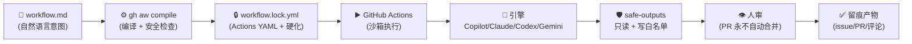
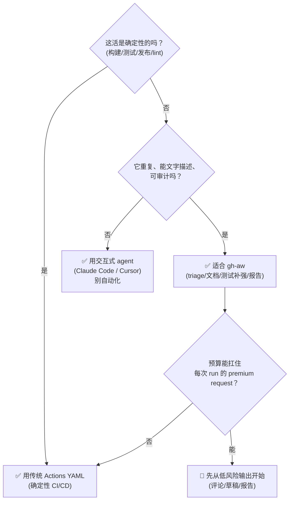

GitHub Agentic Workflows（命令行叫 `gh-aw`[1](https://github.com/github/gh-aw)）在 2026 年 2 月 13 日进入技术预览。它本质上是一个 GitHub CLI 扩展[2](https://cli.github.com/)，负责把你写的 Markdown 工作流编译成 GitHub Actions 里的可执行 workflow[3](https://docs.github.com/actions)。大多数介绍把它说成"用自然语言写 GitHub Actions，少写 YAML"。这是对的，但只对了一成。如果你只记住这句话，会错过它真正值得重视的东西，也会在选型时犯方向性错误。

我的判断很直接：**gh-aw 的核心价值不在"用自然语言替代 YAML"——那是入口；它的核心是一个"编译器 + 安全边界"。它把一个本来无法审计、无法回滚的 AI agent，强行编译成一份可审查的 GitHub Actions YAML，并用 `safe-outputs` 白名单把 agent 的每一次写操作都收进一个留痕、可回滚、需人审的笼子里。** 它不是让 AI 更强，是让 AI 更"可治理"。

这篇文章拆解它的真实机制、安全模型、适用边界和成本，读完你能带走一个判断框架和一份今天就能跑的 starter。

## 先看懂几个核心概念

如果你对 GitHub 生态不熟，先把下面几个词对齐，后文会顺很多：

- `gh-aw[1](https://github.com/github/gh-aw)`：GitHub 官方的 `gh` CLI 扩展[2](https://cli.github.com/)，作用是把 Markdown 形式的 agentic workflow 编译成 GitHub Actions workflow。
- `GitHub CLI[2](https://cli.github.com/)`：GitHub 官方命令行工具，`gh` 是它的主入口；`gh-aw` 不是一个独立平台，而是挂在这个命令行生态上的扩展。
- `GitHub Actions[3](https://docs.github.com/actions)`：GitHub 的自动化执行系统，原本主要跑 CI/CD，现在也能承载 agent workflow。
- `safe-outputs[4](https://github.com/github/gh-aw/blob/main/docs/src/content/docs/introduction/how-they-work.mdx)`：gh-aw 允许 agent 做哪些受控写操作的白名单，比如创建 issue、发评论、提 PR。
- `MCP[5](https://modelcontextprotocol.io/)`：Model Context Protocol，agent 调用外部工具的一种协议层，gh-aw 也会通过它接工具。
- `self-hosted runner[6](https://docs.github.com/actions/hosting-your-own-runners/about-self-hosted-runners)`：你自己机器上的 GitHub Actions 执行器，不是 GitHub 托管 runner。

把这几个概念对上后，再看后面的“编译器”“安全边界”“权限模型”，你就不会把 gh-aw 误解成“只是一个更会写 YAML 的 LLM”。

## GitHub Agentic Workflows 是什么：从研究 demonstrator 到技术预览

先理清一个容易被混淆的点：gh-aw 有两个仓库、两个阶段。

第一站是 **GitHub Next[7](https://githubnext.com/projects/agentic-workflows/)** 的研究项目（`githubnext/gh-aw`，页面在 githubnext.com/projects/agentic-workflows）。GitHub Next 是 GitHub 的 R&D 预览实验室，他们把这个东西定位得很谦虚——原话是"not a product，not even a technical preview"，一个"research demonstrator"，用来探索 agentic 设计空间、学习什么有效什么无效。它甚至明确说自己有"sharp edges"（毛刺）：资源限制、工具可靠性、评估方法、安全性都还没收敛。

第二站是 2026 年 2 月 13 日的[技术预览公告](https://github.blog/ai-and-ml/automate-repository-tasks-with-github-agentic-workflows/)，代码迁到 `github/gh-aw`（也就是你能在 GitHub 上直接装的那个），由 GitHub、Microsoft Research 和 Azure Core Upstream 联合推进。从"学习用的研究演示"升级到"请你来试的技术预览"。

这条时间线本身就是个信息：**它还很早期。** 后面讲成本时你会看到，早期版本甚至因为计费 bug 被整个区间退役过。把它用在生产关键路径上，现在还太早。

一句话定义它的机制：**用自然语言 Markdown 写工作流，`gh aw compile` 把它编译成一份真实的 GitHub Actions YAML（带安全硬化），然后 Actions 调用一个 coding agent 引擎（Copilot / Claude / Codex / Gemini）在沙箱里执行。** 注意"编译"这个词——它是理解 gh-aw 的钥匙。

## 最小工作流长什么样

先看一个能跑的最小例子，来自官方的"每日仓库状态报告"：

````
---
on:
  schedule: daily

permissions:
  contents: read
  issues: read
  pull-requests: read

safe-outputs:
  create-issue:
    title-prefix: "[repo status] "
    labels: [report]

tools:
  github:
---

# Daily Repo Status Report

Create a daily status report for maintainers.

Include
- Recent repository activity (issues, PRs, discussions, releases, code changes)
- Progress tracking, goal reminders and highlights
- Project status and recommendations
- Actionable next steps for maintainers

Keep it concise and link to the relevant issues/PRs.
````

这个文件分两部分：上半是 YAML frontmatter，下半是自然语言指令。frontmatter 里四个关键字段决定了这个 agent 的全部"边界"：

- `on:` —— 什么时候触发（用的是你熟悉的 Actions 触发语法）。
- `permissions:` —— 能访问什么。注意全是 `read`。
- `safe-outputs:` —— agent 被允许向 GitHub "写"什么。这里只允许创建一个带前缀的 issue。
- `tools:` —— agent 有哪些工具（MCP 工具、github、web-fetch 等）。

下面那段 Markdown 就是给 agent 的"需求文档"。注意它的措辞——"Include"、"Keep it concise"——这是给一个**人类队友**的指令，不是逐行规格。官方把这叫"productive ambiguity"（有生产力的模糊）：一句"读覆盖率报告，补高价值测试"人能懂，agent 也能据此主动行动。gh-aw 的设计哲学就是：**用自然语言表达那种"本就该模糊"的意图，再在团队上下文里安全地跑它。**

## gh-aw 的核心机制：它是一个“编译器”

很多人停在"用自然语言写 Actions"这一层就走了。但 gh-aw 真正的设计是**编译模型**，理解成两层最清楚：

- `.md` 文件是**源码**（意图）。
- `.lock.yml` 是**编译产物**（一份真实的、带安全硬化的 GitHub Actions workflow）。

你跑 `gh aw compile`，它读 `.md` 的 frontmatter，生成 `.lock.yml`。**两个文件都要提交进仓库**，而且官方让你在 `.gitattributes` 里标记 lock 文件是生成物、合并冲突时取 ours：

```text
.github/workflows/*.lock.yml linguist-generated=true merge=ours
```

这意味着什么？意味着 gh-aw **没有绕过 GitHub Actions，而是叠在它上面**。生成的就是标准 Actions workflow，你已有的 self-hosted runner、secrets、environments、审计日志、分支保护全都可以复用。迁移成本接近零——不是"换一个平台"，是"在你现有平台上多了一层"。

也正因为是编译，所有安全检查发生在**编译时**：上下文变量替换被严格限制（防模板注入）、依赖 SHA 锁定、工具走 allowlist、权限最小化。这些问题在"运行时才发现"就晚了，gh-aw 把它们前移到编译这一步。

整条流水线是这样的：



这条链有一个关键的认知升级点：**.md 是给人读的意图，.lock.yml 是给 Actions 跑的、也是给人审的可执行产物。** 你不必信任 agent 的"思考"，你只需要审那份生成的 YAML 和它请求的 safe-outputs。这是 gh-aw 区别于一切"黑盒 agent 产品"的地方——官方原话："no hidden prompts or secret sauce"，生成的 YAML 完全可检视，行为端到端归你所有。

## 安全是它真正的差异化

如果说编译器模型是"骨架"，那安全边界才是 gh-aw 的"灵魂"，也是它和"自己在 Actions 里跑个 Claude CLI"最本质的区别。

先说对比对象。另一种常见做法是：在一个普通 Actions YAML 里直接 `run: claude` 或挂个 `claude-code-action`。这种做法的问题官方点得很直白——"often grants these agents more permission than is required"，**过度授权**。你为了能创建 PR，给了 agent 完整的 `GITHUB_TOKEN` 写权限，它能改任何东西。

gh-aw 反过来，**默认只读**。agent 想往 GitHub 写任何东西，都必须通过 `safe-outputs`：这是一组**预定义的、可审查的、经过清洗的 GitHub 操作**——`create-pull-request`、`create-issue`、`add-comment`、`add-label` 等等。agent 没有"写"权限，它只能**请求**一个 safe-output，而这个请求本身经过安全层校验、留下人可见的产物（评论 / PR / 日志），而不是静默修改。

它的威胁模型列得很实在：提示注入、恶意 MCP 服务器、恶意 agent、工具调用的副作用、数据外泄。对应的纵深防御好几层——最小权限 token、工具 allowlist、网络隔离、沙箱执行、MCP 代理过滤、能"否决"或"要求人审"的钩子。还有一条硬规则：**pull requests 永远不会自动合并，人必须始终审查批准。**

我为什么强调这一点？因为评估任何一个"agent 平台"时，真正决定它能不能上生产的从来不是"模型够不够强"，而是三个问题：**默认权限是什么？副作用留不留痕？能不能回滚/人审？** gh-aw 把这三个问题都用 Actions 二十年攒下的基建回答了。这是它最被低估的价值——不是"能用 AI"，是"让 AI 可治理"。

## 引擎中立：一份工作流，换四个模型

gh-aw 还有一个工程上很值钱的特性：**引擎中立**。同一份 `.md`，你可以配置 Copilot（默认）、Claude、Codex、Gemini 任意一个来跑。

这不是噱头。它的实际用途有两个：**可移植**（你不被锁死在某一家的模型和定价上，今天用 Claude、明天换 Codex 不用重写工作流）和**可对比**（同一个仓库任务，让不同引擎跑，比较行为和护栏的差异——官方说这恰好是他们做研究 demonstrator 的动机之一：在近乎相同的输入下评估各 coding agent 的安全特性）。

放在 2026 年这个模型每月都在洗牌的节点，"意图和引擎解耦"是个很务实的赌注。你的工作流沉淀的是**仓库知识**（该 triage 什么、文档该更新什么），而不是对某个模型的依赖。模型会过时，仓库知识不会。

## 什么时候该用，什么时候别碰

gh-aw 官方反复强调一句话当心智模型：**"如果仓库里某件重复的活能用文字描述清楚，那它可能就适合 agentic workflow。"** 但更重要的判断是它和传统 CI/CD 的边界。

官方明说:**别拿 gh-aw 替代 YAML 写的 CI/CD**(构建、测试、发布)。它和确定性流水线"用途基本不重叠",是用来增强、不是替代。原因是根本性的--agent 靠"理解自然语言"行动,有歧义就有偏差,而构建/测试/发布要的是 100% 确定性、零幻觉——像 [Yocto 那种嵌入式构建](/2015/03/11/yocto/) 或 [本博客用 Pelican 搭建部署](/2015/02/18/how_to_build_gitcafe_pages_by_pelican/) 的链路，就该老老实实留给 YAML CI。把发布压在一个会“理解”指令的 agent 上，是拿钱和稳定性开玩笑。

我把它收敛成一个三问决策框架，你拿到任何仓库任务先过一遍：



落到具体场景，gh-aw 的甜区是这些"不起眼但费时"的维护活：issue triage 和打标、文档随代码同步、CI 失败后自动排查并提修复 PR、按覆盖率报告补测试、定期仓库健康报告。注意一个共同点——它们都是**重复、协作、可审计、又没法用简单启发式表达**的任务，恰好需要"一点判断力"。Home Assistant 的 Franck Nijhof 那句评价很到位：gh-aw 帮维护者做的是"judgment amplification"（判断力放大）——数千个 open issue 没人能逐个看，agent 帮你 surface 重要的。

反过来，明确不该用：一次性任务（自动化不回本）、需要深度交互式探索的任务（agent 跑在 Actions 分钟级，不是实时的，不如开个 Claude Code 对话）、以及任何关键路径（钱、发布、安全）。

## 成本和真实落地

gh-aw 不是免费的午餐。它每次 run 都烧模型调用，有账可算。

官方给了一个可量化的数字：用 Copilot 默认配置时，**每次 workflow run 大约消耗 2 个 premium request**——1 个给 agent 干活，1 个给 safe-output 做守卫检查。这意味着你不能像跑 `actions/checkout` 那样无脑高频触发，得算着用。目前 Copilot 的自动化使用还绑定在某个用户账号上，企业规模化要理清计费归属。

还有个很现实的信号：**版本 0.68.4 到 0.71.3 因为一个影响计费的 bug 被整个区间退役**，官方催着升级。一个会算错钱的功能还在频繁出这类 bug，说明它离"稳"还有距离。我的建议是：现在就拿来玩、拿来试、拿来在低风险仓库里养工作流，但别让它碰生产关键路径，也别在没盯成本的情况下挂 `schedule: daily` 跑一晚上。

真实落地的案例是有的，而且不是 demo 级：**Home Assistant**（GitHub 头部项目之一）用它分析 issue、聚焦重点；**CNCF**（云原生计算基金会，CTO Chris Aniszczyk 出面背书）用它做文档自动化和跨组织 reporting，称这是降低 AI 试验门槛的"cultural shift"；**Carvana** 这家企业用它做跨多仓库的工程改动。这些案例说明甜区是真的——开源维护和大型组织的"维护杂活"。

官方还提供了一批设计模式可抄：ChatOps、DailyOps、IssueOps、MultiRepoOps、Orchestration 等，在 [Peli's Agent Factory](https://github.github.com/gh-aw/blog/2026-01-12-welcome-to-pelis-agent-factory/) 里有导览。

## 今天就能跑的 starter

如果你想动手，最小路径是三条命令：

```bash
# 1. 装 gh-aw 扩展（需要先有 gh CLI 并登录）
gh extension install github/gh-aw
gh aw version            # 确认装好

# 2. 建一个工作流（会生成 .md，你再编辑上面那段日报模板）
gh aw new daily-repo-status

# 3. 编译成 .lock.yml，本地可 watch 调试
gh aw compile --watch
gh aw run                # 本地试跑
gh aw logs daily-repo-status   # 看运行日志
```

落地节奏我建议照官方的来，很稳：**先从低风险输出开始**（评论、草稿、报告），跑顺了再开 `create-pull-request`；编码类先做目标导向的小改进（重构、补测试），别一上来就让它做新功能。还有一条铁律——**人要留在更大的循环里**。gh-aw 的 agent 子循环是自主的，但仓库真正往前走靠的是人审它产出的 issue 和 PR。把 Markdown 当代码对待：小步提交、走 review、有意识地演进。

## 常见问题（FAQ）

### gh-aw 和直接在 Actions 里跑 Claude/Codex CLI 有什么区别？

核心区别在权限模型。自己跑 CLI 通常给 agent 完整 `GITHUB_TOKEN` 写权限，过度授权；gh-aw 默认只读，所有写操作走 `safe-outputs` 白名单，每个 PR/评论都是预批准的可审查动作，且 PR 永不自动合并。一句话：前者默认放权，后者默认安全。

### gh-aw 能替代传统的 GitHub Actions YAML 吗？

不能，也不该。官方明确说它和确定性 CI/CD（构建/测试/发布）用途基本不重叠，是用来增强不是替代。确定性任务用 YAML，需要"一点判断力"的重复维护活才用 gh-aw。

### gh-aw 怎么收费？

用 Copilot 默认配置时，每次 run 大约消耗 2 个 premium request（1 个 agent + 1 个 safe-output 守卫检查）。模型可配置以控制成本。目前自动化 Copilot 使用绑定用户账号，其他引擎见官方引擎文档。注意早期版本（0.68.4–0.71.3）有计费 bug，需升级到最新版。

### 它现在能上生产吗？

谨慎。它 2026 年 2 月才进技术预览，官方自己承认有"sharp edges"（资源限制、工具可靠性、评估、安全都未收敛），还出现过计费 bug 退役区间。建议先在低风险仓库、低风险输出（评论/草稿/报告）上试，关键路径再等等。

### safe-outputs 到底是什么？

一组预定义、可审查、经过清洗的 GitHub 写操作（如 `create-pull-request`、`create-issue`、`add-comment`、`add-label`）。agent 没有写权限，只能"请求"执行某个 safe-output，请求经安全层校验并留人可见产物。它是 gh-aw 权限模型的核心，不是可选装饰。

## 结尾：自动化之前，先读懂被自动化的东西

gh-aw 把开源维护里那些"不起眼但费时"的杂活--triage、文档同步、测试补强--变成了可编译、可审计、可回滚的自动化。这确实是好事。但有个反面值得记住:这些杂活之所以存在,是因为开源本来是靠人的判断和社区凝聚运转的。在你急着把它们自动化掉之前,值得先回头读懂那套人本逻辑——我推荐读一读[《大教堂与集市》](/2024/09/20/The-Cathedral-the-Bazaa/)。

gh-aw 不是终点，compile 这一步本身就是过渡态——官方的愿景是"有一天 commit 一个 .md 进 `.github/workflows`，agentic 的事就自动开始发生，就像今天的 YAML 一样"。在那一天到来前，它是个值得你装上、在低风险仓库里养工作流的研究预览。装上它，审那份 lock.yml，从一条日报 issue 开始。

## 参考

- [GitHub Agentic Workflows 仓库（github/gh-aw）](https://github.com/github/gh-aw) — 技术预览版代码与 README
- [技术预览公告（GitHub Blog, 2026-02-13）](https://github.blog/ai-and-ml/automate-repository-tasks-with-github-agentic-workflows/) — 官方发布说明
- [GitHub Next 项目页（githubnext.com）](https://githubnext.com/projects/agentic-workflows/) — 研究 demonstrator 阶段的设计哲学与"为何不是产品"
- [How They Work 文档](https://github.com/github/gh-aw/blob/main/docs/src/content/docs/introduction/how-they-work.mdx) — 工作流结构与安全设计
- [Peli's Agent Factory](https://github.github.com/gh-aw/blog/2026-01-12-welcome-to-pelis-agent-factory/) — 工作流模式导览

## What's next

- [《大教堂与集市》](/2024/09/20/The-Cathedral-the-Bazaa/) — 本文讲了“自动化维护杂活”，那篇讲开源靠人凝聚的本来面貌。自动化之前，先读懂被自动化的东西。
