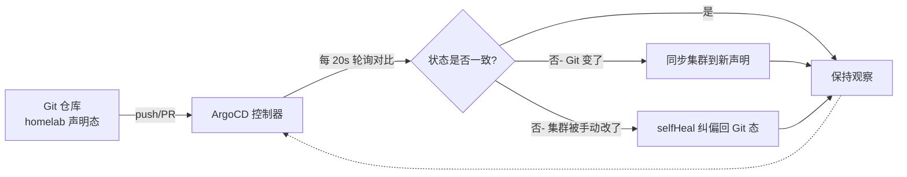
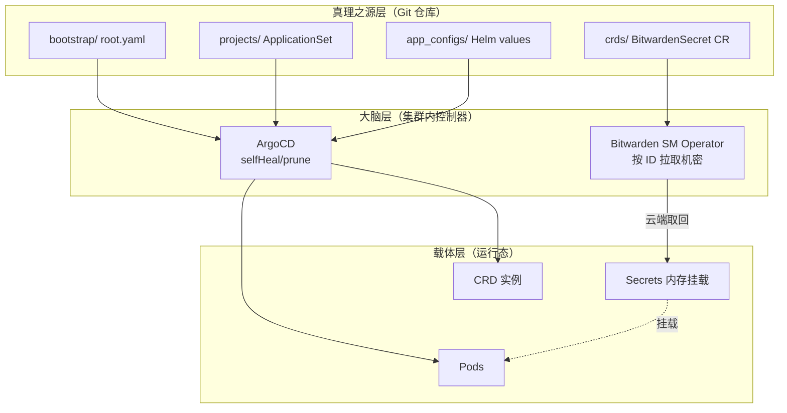
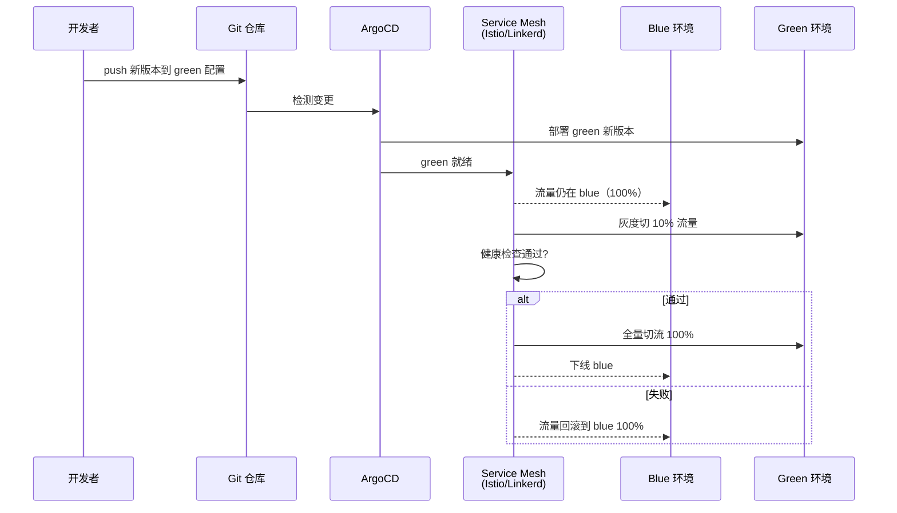

家用服务器最怕的不是性能不够，是一次断电之后再也拼不回原来的样子。我这篇复盘要给的结论很直接：在 Homelab 里把整个集群的真理之源押到 Git 仓库上，用 [ArgoCD][3] 做声明式同步、用 [Bitwarden Secrets Manager Operator][13] 注入机密，是目前家用环境里恢复成本最低、抗摧毁能力最强的组合。机密管理和 [GitOps][2] 这两块，我的 `requirement.md` 里已经全部打勾落地；但蓝绿发布和状态可视化监控，至今还是空缺——这才是真正卡住"全自动化"的痛点。

先说"得"的部分：机密不再散落在备忘录和 shell history 里，Bitwarden 在云端统一管，手机上改了密码集群自动同步；ArgoCD selfHeal 把任何手贱的 `kubectl apply` 都自动纠偏回 Git 声明的状态，停电恢复后基本不用人介入。再说"失"：我在 `architecture.md` 里规划过用 [Service Mesh][16] 做蓝绿流量切换，但一直没落地；更要命的是监控也没补上，集群出问题时我常常是最后一个知道的。

还有一个我得讲清楚的权衡——企业环境里落地这套，[SOPS][6] 这类把密文直接加密进 Git 的方案可能比依赖外部 Operator 更合适。Homelab 选 Bitwarden 是图手机端改密码的便利，但这个 trade-off 不是没有代价。下面我就按"灾难 → 诅咒 → 破局 → 深水区 → 防坑"的顺序，把整条演进路径摊开讲。

## 停电之夜：当"跑起来就行"变成基础设施的灾难

上个月一个周末，小区突发短暂断电。等供电恢复、机器重新亮起绿灯时，我盯着无法访问的 Homelab 导航页陷入了沉思。这台跑着多架构混合服务的机器，底座系统还是当年踩坑[跨架构构建 deb](https://pkking.github.io/2015/05/12/crossBuild/)才装稳的。

以前折腾家里这台服务器，信奉的哲学就是"跑起来就行"。应用越堆越多——从自托管的 [stable-diffusion-webui](https://pkking.github.io/2023/08/29/stable-diffusion-webui/) 到 [n8n][12] 自动化，再到各种数据库——部署方式也五花八门：有的靠手动敲 `docker run`，有的靠不知塞在哪个目录下的 `docker-compose.yml`，后来上了 [Kubernetes][7]，又变成对着一堆散落的 YAML 手动执行 `kubectl apply`。机器平稳运行时，这种玄学状态还能勉强维持岁月静好的假象。但断电重启，直接把这层遮羞布扯得粉碎。

几个容器起不来，靠 `docker ps` 一个个翻日志能救回来；可上了 K8s 之后，一个 Pod 挂了到底是镜像问题、ConfigMap 没挂对、还是上次手抖改了某个 Service 的 selector？没有单一真相来源，排查全凭记忆。那晚我守着终端到凌晨两点，第二天顶着黑眼圈下定决心——这套"跑起来就行"的野路子，必须结束。

## 灾后重建的绝望，与"配置漂移"的诅咒

断电那次真正让我绝望的不是重启，是重建。我要找回那些当初试错试出来的环境变量、找散落在三四个备忘录和 Telegram 自建频道里的野路子配置，还要回忆某个 [Helm][10] release 当初到底 override 了哪些 value。有些配置只在当时的 shell history 里存在过，而那台机器的 shell history 早随着重装灰飞烟灭。

这就是 [配置漂移][1]（Configuration Drift）的诅咒：运行态和声明态一点点偏离，而且偏离的过程没有任何记录。等灾难来临你才发现，你以为自己拥有一个集群，其实你只拥有一堆"当时这么敲过"的模糊记忆。

这里有个常见误解得说清楚：很多人把 GitOps 等同于 CI/CD push 流水线，以为配个 GitHub Actions 跑 `kubectl apply` 就算 GitOps 了。其实不是。GitOps[2] 的核心是 pull 模式——集群侧的控制器持续去拉 Git 的声明状态并与之对齐，而不是流水线主动 push。差别在哪？push 模式下，流水线跑完就不管了，之后谁手动改了集群它一无所知；pull 模式下，控制器会持续监听并纠正偏离。这个差别，正是抗配置漂移的关键。

那问题来了：个人微型数据中心，怎么拥有抗摧毁的"不死之身"？

## 绝对真理：砍掉 Kubectl 权限，用 ArgoCD 固化集群灵魂

我的破局点很粗暴——把 Git 仓库当作唯一真理之源，然后尽量砍掉自己直接动集群的权限。[ArgoCD][3] 负责持续把 Git 声明的状态拉到集群里，任何手动改动都会被自动回滚。这套做法甚至做到了连 ArgoCD 自己都是被 Git 管起来的，用 [argo-cd-autopilot][5] 做自举（bootstrap）。

下面是 [源码仓库][17] 里 `bootstrap/root.yaml` 的真实内容，它是整个集群的自举入口：

```yaml
apiVersion: argoproj.io/v1alpha1
kind: Application
metadata:
  name: root
  namespace: argocd
spec:
  destination:
    namespace: argocd
    server: https://kubernetes.default.svc
  project: default
  source:
    path: projects                          # 根 App 指向 projects/ 目录
    repoURL: https://github.com/pkking/homelab.git
  syncPolicy:
    automated:
      allowEmpty: true
      prune: true                           # 删 Git 即删集群资源
      selfHeal: true                        # 手动改动会被自动纠偏
```

说下它怎么跑：root Application 自己就声明在 `argocd` 命名空间里，它的 source 指向 Git 仓库的 `projects/` 目录。`selfHeal: true` 是整个设计的灵魂——这意味着不管谁手贱去 `kubectl edit` 了集群里的资源，ArgoCD 检测到状态偏离后会自动把它纠回 Git 声明的样子；`prune: true` 则保证我在 Git 里删掉一个应用，集群里对应的资源也会被清掉。换句话说，Git 仓库删一行，集群里就少一个服务，完全不用人去收拾。

仓库的目录结构也对应了这套分层思维，下面是真实结构（不是编的）：

```
bootstrap/      集群底座：argo-cd/（ArgoCD 自身）、cluster-resources/、root.yaml
projects/       AppProject + ApplicationSet（应用批量生成入口）
apps-index/     Helm umbrella chart：n8n/postgresql/bitwarden/argo-event 等
app_configs/    各服务 Helm values：*_values.yaml
crds/           CRD 定义：csi/、n8n/、postgresql/（含 secrets.yaml）
operators/      Operator 部署：postgresql/
apps/           各应用目录（供 ApplicationSet 扫描 config.json）
```

真正让我觉得"爽"的是应用批量生成那套机制。`projects/default.yaml` 里用一个 [ApplicationSet][4] + Git Generator，动态扫描每个应用的配置文件：

```yaml
apiVersion: argoproj.io/v1alpha1
kind: ApplicationSet
metadata:
  name: default
  namespace: argocd
spec:
  generators:
  - git:
      files:
      - path: apps/**/default/config.json   # 扫描每个应用的配置文件
      repoURL: https://github.com/pkking/homelab.git
      requeueAfterSeconds: 20               # 每 20 秒轮询一次 Git
  template:
    metadata:
      name: default-{{ userGivenName }}
    spec:
      destination:
        namespace: '{{ destNamespace }}'
      source:
        path: '{{ srcPath }}'
        repoURL: '{{ srcRepoURL }}'
      syncPolicy:
        automated: { prune: true, selfHeal: true }
```

原理是这样：新增一个服务，我要做的全部操作就是往 `apps/<服务名>/default/config.json` 丢一个 JSON 文件并 push 到 Git。ApplicationSet 的 Git Generator 每 20 秒扫一次 `apps/**/default/config.json`，发现新文件就读出里面的 `userGivenName`、`destNamespace`、`srcPath` 等字段，自动渲染出一个 ArgoCD Application。这就是"丢个 JSON 就能拉起服务"的真相——不是什么魔法，是 Git Generator 把目录扫描变成了声明式应用工厂。

这套东西跑稳之后，我几乎都忘了 `kubectl` 怎么拼了。现在所有变更都走 PR——顺带一提，仓库的 CI 我也用 [GitHub Agentic Workflows](https://pkking.github.io/2026/06/27/gh-aw-overview/) 做了自动化，但那是 push 侧的事；集群侧的拉起完全是 ArgoCD 的 pull 模式。停电恢复后 ArgoCD 会在十几分钟内把一切分毫不差地拉回来，因为真理在 Git 里，集群只是 Git 的一个投影。

下面这张图把 ArgoCD 的调和循环画了出来：



一句话总结这张图：Git 是唯一输入，集群只是被动投影。任何手贱 `kubectl edit` 改出来的状态都只是临时假象，迟早被 selfHeal 抹回 Git 声明的样子——这正是停电后不用人介入就能恢复的底层机制。

## 机密管理：阻碍"全自动化恢复"的最后一块绊脚石

GitOps 把应用配置都收编了，但有一类东西天然不能进 Git——密码、Token、API Key。如果不解决机密，"100% GitOps"就是个半残的口号，因为恢复时总得有人手动去填一遍密码。

还有个流传更广的误解："[Kubernetes][7] Secret 是安全的"。错。design.md 里写得很直白：Kubernetes Secret 只是 base64 编码，`not secure enough for sensitive information`。base64 是编码不是加密，`echo <value> | base64 -d` 一秒还原。把 base64 的 Secret 提交到 Git 仓库，等于明文存密码。这个坑我早期踩过，后来下决心必须上专门的机密管理方案。

我选的是 [Bitwarden Secrets Manager Operator][13]。选它的理由很实际：原生 K8s 集成、Pod 运行时注入机密、有 web 控制台在线编辑、最关键的是手机 App 能随时改密码——对一个 Homelab 玩家来说，躺床上发现某个服务密码该轮换了，掏出手机就能改，集群自动同步，这体验比啥都强。

下面是 `crds/postgresql/secrets.yaml` 里的真实配置（[CRD][8]，即自定义资源定义）：

```yaml
apiVersion: k8s.bitwarden.com/v1
kind: BitwardenSecret
metadata:
  name: n8n-user-bw-secret
spec:
  organizationId: "b438a2aa-..."          # Bitwarden 组织 ID
  authToken:
    secretName: bw-auth-token
    secretKey: token
  map:
    - bwSecretId: b432b279-...            # 指向 Bitwarden 云端条目
      secretKeyName: username
    - bwSecretId: 67aac42e-...
      secretKeyName: password
```

它的机制是：YAML 里压根没有明文密码，只有两个 `bwSecretId` 占位符。[Pod][9] 启动时，集群里的 Bitwarden Operator 拿认证 Token 去 Bitwarden 云端，按这些 ID 把真正的账号密码取回来，在内存里挂载给容器。改密码只需在 Bitwarden 手机端操作，Operator 检测到云端变化会自动刷新集群里的 Secret。所以 Git 仓库里只有"去哪取密码"的地址，没有密码本身——至少表面上是这样。

但这里有个我必须如实交代的权衡。design.md 里专门点了名：`BitwardenSecret` 自定义资源里 inline 了 `organizationId` 和 `bwSecretId`，这两个值是明文进 Git 的。它们虽然不是密码本身，却等于暴露了机密在 Bitwarden 云端的"地址"——拿到这些 ID 加上一个泄露的 auth token，就能定位并取走机密。在一个公开的 Git 仓库里，这个风险是实打实的。

这就引出了我反复纠结的方案对比。如果是企业落地，我倾向于认为 [SOPS][6]（Secrets OPerationS，Mozilla 开源的机密编辑器）可能比依赖外部 Operator 更合适：SOPS 可以只加密 YAML 里的敏感字段、把密文整体提交进 Git，机密的"地址"和"内容"都加密了，恢复时用 KMS 解密，完全不依赖一个长驻的外部 Operator 去访问云端。它的代价是没有 Bitwarden 那种手机端随时改密码的便利，且需要管理解密密钥。Homelab 我最终留在 Bitwarden，核心就是图那个手机端编辑的便利，但这个 trade-off 必须讲清楚——便利是用"暴露机密地址"换来的。

顺带一提，design.md 也留了演进口：未来可能通过 [External Secrets Operator][14] 这层通用抽象，切到 AWS Secrets Manager 或 HashiCorp Vault，架构是有升级空间的。下面这张分层架构图把当前的 GitOps + 机密管理整体串起来：



看这张图要抓两条链路：上面那条是应用配置链（`bootstrap/projects/app_configs` 三层声明喂给 ArgoCD，由它拉起 Pod 和 CRD 实例）；下面那条是机密链（`crds/` 里的 BitwardenSecret CR 单独喂给 Bitwarden Operator，Operator 拿 ID 去云端取回密码，在内存挂载给 Pod）。两条链在 `D1 Pod` 处汇合——应用配置和机密注入是解耦的，各走各的控制器，这才能做到改密码不动应用、改应用不动密码。

## 伪需求与真痛点：Homelab 不需要蓝绿发布

走到这一步，机密和 GitOps都通了，按理说该心满意足。但我翻自己的 `requirement.md`，第 3 条"蓝绿部署"三个子项全是 `[ ]` 未勾选，`architecture.md` 里还白纸黑字写着要用 Service Mesh 做 blue/green 流量切换。我当初为啥规划它、又为啥一直没做？

我得承认，蓝绿/灰度发布对个人 Homelab 是 overkill。家用环境真正想要的就是三件事：一键拉起、不怕搞坏、坏了能回滚，零停机平滑升级那套根本不是刚需。一个服务凌晨挂了十分钟，没人给我开故障工单；但我得能知道它挂了、并一键切回上个版本。换句话说，真正卡我的是“状态可视”和“快速回滚”这两件事——蓝绿发布解决不了前者，GitOps 的 selfHeal 倒是已经覆盖了后者（Git revert 即回滚）。

另一个容易跑偏的认知：把蓝绿/灰度当成必备的企业级特性。对企业可能是，对 Homelab 玩家，它优先级排错了。真正卡我的是 `requirement.md` 里 Additional Considerations 提到的 Monitoring/logging 至今没落地——集群哪个 Pod 在 OOM、哪个 PVC 快满了、ArgoCD 同步失败了我都是最后一个知道。这才是真痛点。

不过我没把话说死。蓝绿本身没错，问题出在“现在就上”。`architecture.md` 规划的蓝绿 + Service Mesh 流量切换长这样，我画出来供参考（这是理想形态，目前未落地）：



图看着很美，但对我现在的 Homelab，上 Service Mesh 仅为做蓝绿流量切换，投入产出比太低。我的判断是：下一步引入 Service Mesh，定位要改成"为可观测性和流量可见"，而不是"为蓝绿切换"。这跟旧版草稿里"根本不值得部署 Service Mesh"的结论相反——我现在认为值得部署，但动机变了：Service Mesh 能给我服务间调用的拓扑、延迟、错误率这些黄金指标，正好补上监控这块短板；蓝绿流量切换只是它捎带的能力，等监控跑顺了再考虑也不迟。

所以这条演进路径的终局判断是：GitOps + 机密管理是地基，已经夯实；蓝绿发布是"锦上添花"而非"雪中送炭"，当前优先级压在监控之后；下一步引入 Service Mesh 的第一目标是可观测性，第二目标才是流量治理。用一次性的折腾，换长期的运维自由。

## 常见问题（FAQ）

**Homelab 一定要上 K8s 吗？**
不一定。如果你的服务就三五个、不常变动，docker-compose 完全够用，配个 [dotfiles](https://pkking.github.io/2026/02/07/dotfiles/) 把配置版本化管理就挺稳。上 [K3s][11]（K8s 的轻量发行版）的门槛其实不高，但你得愿意为声明式思维付学习成本。我上 K8s 是因为服务多到手动管不过来，且想要自动故障恢复。

**SOPS 和 Bitwarden Secrets Manager 怎么选？**
看你更在意"机密完全在 Git 里"还是"手机端随时改"。SOPS 把密文加密进 Git、不依赖外部 Operator，审计和离线恢复更干净，适合企业或重视自包含的场景；Bitwarden SM Operator 改密码方便、有云端兜底，但 inline 的 org/secret ID 有地址泄露风险，且依赖 Operator 常驻。我个人在 Homelab 选 Bitwarden 图便利，企业场景我会倾向 SOPS。

**ArgoCD 和 [Flux][15] 有什么区别？**
两者都是 GitOps 的 pull 模式控制器。ArgoCD 提供 Web UI、能可视化看到应用同步状态和差异，上手直观；Flux 更偏向 CLI 和 GitOps 原教旨主义，组件更模块化。我选 ArgoCD 主要是图那个 UI——集群出问题时一眼能看见哪个应用 OutOfSync。

## 参考资料

- [1] Configuration drift（配置漂移）: https://en.wikipedia.org/wiki/Configuration_drift
- [2] GitOps: https://www.weave.works/technologies/gitops/
- [3] ArgoCD: https://argo-cd.readthedocs.io/
- [4] ArgoCD ApplicationSet: https://argo-cd.readthedocs.io/en/stable/user-guide/application-set/
- [5] argo-cd-autopilot: https://argocd-autopilot.readthedocs.io/en/stable/
- [6] SOPS（Secrets OPerationS）: https://github.com/getsops/sops
- [7] Kubernetes: https://kubernetes.io/
- [8] Kubernetes CRD（自定义资源定义）: https://kubernetes.io/docs/concepts/extend-kubernetes/api-extension/custom-resources/
- [9] Kubernetes Pod: https://kubernetes.io/docs/concepts/workloads/pods/
- [10] Helm: https://helm.sh/
- [11] K3s: https://k3s.io/
- [12] n8n: https://n8n.io/
- [13] Bitwarden Secrets Manager Operator: https://bitwarden.com/help/secrets-manager-kubernetes-operator/
- [14] External Secrets Operator: https://external-secrets.io/
- [15] Flux（GitOps 控制器）: https://fluxcd.io/
- [16] Service Mesh: https://en.wikipedia.org/wiki/Service_mesh
- [17] pkking/homelab 源码仓库: https://github.com/pkking/homelab

[1]: https://en.wikipedia.org/wiki/Configuration_drift
[2]: https://www.weave.works/technologies/gitops/
[3]: https://argo-cd.readthedocs.io/
[4]: https://argo-cd.readthedocs.io/en/stable/user-guide/application-set/
[5]: https://argocd-autopilot.readthedocs.io/en/stable/
[6]: https://github.com/getsops/sops
[7]: https://kubernetes.io/
[8]: https://kubernetes.io/docs/concepts/extend-kubernetes/api-extension/custom-resources/
[9]: https://kubernetes.io/docs/concepts/workloads/pods/
[10]: https://helm.sh/
[11]: https://k3s.io/
[12]: https://n8n.io/
[13]: https://bitwarden.com/help/secrets-manager-kubernetes-operator/
[14]: https://external-secrets.io/
[15]: https://fluxcd.io/
[16]: https://en.wikipedia.org/wiki/Service_mesh
[17]: https://github.com/pkking/homelab
